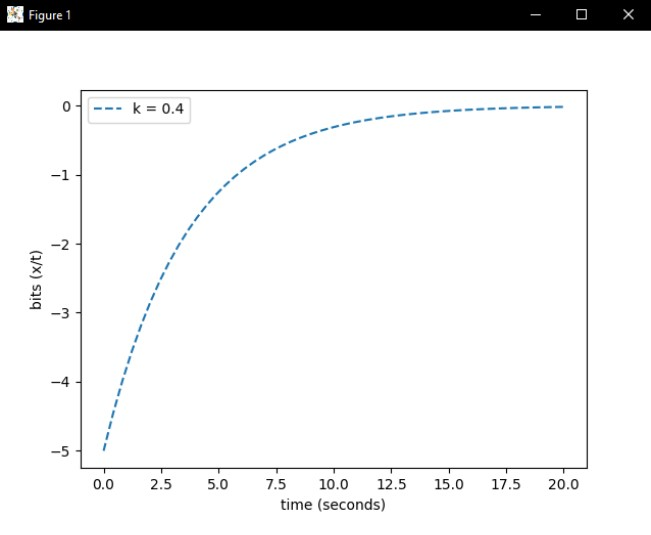

# CST-305 Project 1: Visualize ODE With SciPy

# Setup
* Download version 3.8.2+ of Python 
* Install pip
* Create a new project. Within the terminal, use pip to install the libraries below:

* `pip install numpy`, `pip install matplotlib`, `pip install scipy`

* Download the code and locate the main.py file's directory
* In the terminal, change the directory to the location of main.py
* Run main.py

# Network Data Rate Visualization Using SciPy

This project models and visualizes the behavior of a network's data rate using an Ordinary Differential Equation (ODE). The solution is implemented in Python, leveraging numerical methods provided by SciPy. The final result includes a graph illustrating the relationship between time and data rate based on the derived equation.

---

## Overview

The project addresses the problem of determining the data rate of a network using the following equation:

$$
bps = -k \cdot \log_2(x)
$$

Through mathematical derivation, the equation was reformulated into a differential equation. Using Python, the ODE was solved numerically, and its behavior was visualized to analyze how the network's data rate evolves over time.

---

## Key Features

- **ODE Derivation**: The project involves deriving a differential equation from the base equation to model network behavior.
- **Numerical Solution**: Utilized the `odeint` function from SciPy to solve the ODE.
- **Graphical Visualization**: Generated graphs using Matplotlib to visualize the network's data rate over time.
- **Validation**: Verified the correctness of the derivation and solution using online computational tools and references.

---

## Technical Details

### Approach
1. **Define the Problem**: The data rate was modeled using a logarithmic equation. Its derivative formed the basis of the ODE.
2. **Implement the Solution**:
   - Defined the ODE function in Python.
   - Used SciPy's `odeint` to compute numerical solutions.
   - Created a time-series plot to illustrate the results.
3. **Validate Results**: Verified the ODE and solution using external tools and compared the graph with theoretical expectations.

### Tools and Libraries
- **Python**: Programming language used for implementation.
- **SciPy**: For numerical solution of the ODE.
- **Matplotlib**: For data visualization.
- **NumPy**: For handling mathematical operations and arrays.

---

## Graphical Output

The following graph demonstrates the behavior of the network's data rate over time, where \( k = 0.4 \):

---

## Key Insights

- The network data rate follows a predictable decay pattern over time, as modeled by the derived ODE.
- The use of numerical methods ensures accurate and efficient computation of the solution, making this approach applicable to real-world network performance analysis.
- [Full Report](https://github.com/AsePlayer/Principles-of-Modeling-and-Simulation/blob/f03f1bf89f0b4d372035ecacf4d00bbba97dbbc2/1%20-%20Visualize%20ODE%20With%20SciPy/Project%201%20%E2%80%93%20Visualize%20ODE%20With%20SciPy%20Document.pdf)

---

## How to Run the Project

* Download version 3.8.2+ of Python 
* Install pip
* Create a new project. Within the terminal, use pip to install the libraries below:

* `pip install numpy`, `pip install matplotlib`, `pip install scipy`

* Download the code and locate the main.py file's directory
* In the terminal, change the directory to the location of main.py
* Run main.py
