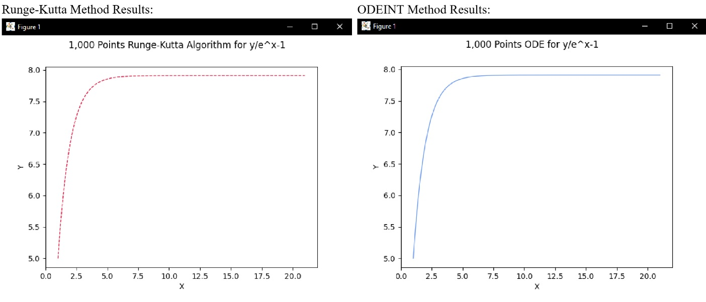
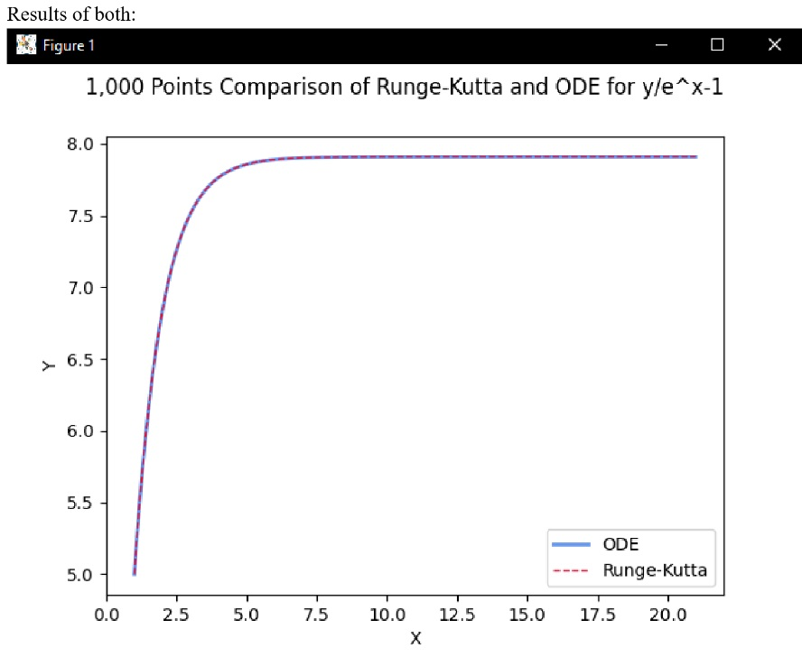

# Runge Kutta for ODE

## Purpose
This project implements and compares the Runge-Kutta method for solving Ordinary Differential Equations (ODEs) with the optimized `odeint` solver from SciPy. It aimed to evaluate the precision and performance of both methods and visualize the results through graphs.

## Key Features
- **Runge-Kutta Algorithm**: Custom method to solve ODEs.
- **`odeint` Solver**: Comparison using SciPy's built-in function.
- **Visualization**: Results graphed using Matplotlib.
- **Performance Optimization**: Explored improvements using rounding and Numba.

## Challenges & Solutions
- Ensuring accuracy with Runge-Kutta compared to `odeint`.
- Investigated performance enhancements like rounding and using Numba for optimization.

## Outcome
The project highlighted the differences in precision and computational speed between the custom Runge-Kutta method and `odeint`, providing valuable insights into the efficiency and accuracy trade-offs for solving ODEs.

## Screenshots

### Runge-Kutta vs ODE Comparison Graphs
Below are the graphical results of both the Runge-Kutta method and the `odeint` solver, showing how the two methods approximate the same ODE:

Runge-Kutta & ODE Solution Graph        |  Comparison of Runge-Kutta and ODE Solutions
:-------------------------:             |:-------------------------:
  |  

> These graphs visually depict the differences and similarities in the solutions generated by the Runge-Kutta and `odeint` methods.

## How to Run the Project

* Download version 3.8.2+ of Python 
* Install pip
* Create a new project. Within the terminal, use pip to install the libraries below:

* `pip install numpy`, `pip install matplotlib`, `pip install scipy`

* Download the code and locate the main.py file's directory
* In the terminal, change the directory to the location of main.py
* Run main.py
