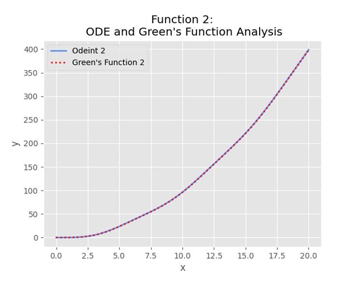

# Green's Function and ODE with IVP

### Overview
This project investigates the solution of second-order ordinary differential equations (ODEs) using three different methods: **Green's Function**, **Method of Undetermined Coefficients**, and **Variation of Parameters**. The project demonstrates how these methods can be used to solve two different differential equations with initial value problems (IVPs), and compares their performance in terms of ease of implementation and computational efficiency.

### Equations Analyzed
1. **Equation 1:**
   $y'' + 2y' + y = 2x, \quad t \geq 0, \quad y(0) = y'(0) = 0$

   
2. **Equation 2:**
   $y'' + y = x^2; \quad t \geq 0; \quad y(0) = y'(0) = 0$

---

### Methods Employed

#### 1. **Green’s Function**
   Green’s function provides a method for solving inhomogeneous linear differential equations. It decomposes the solution into the sum of the homogeneous solution and a particular solution. The method involves integrating the Green's function with the source term.

#### 2. **Method of Undetermined Coefficients**
   This method assumes a trial solution for the non-homogeneous part of the equation and determines the coefficients by substituting the trial solution into the differential equation.

#### 3. **Variation of Parameters**
   Variation of Parameters modifies the constants of the homogeneous solution to produce a particular solution for the non-homogeneous equation.

---

### Results and Observations

Both equations were solved using the three methods mentioned. The outcomes were consistent across methods, with each one providing the expected solutions. However, certain observations were made during the implementation:

- The **Method of Undetermined Coefficients** was found to be the most straightforward and efficient for both equations.
- **Green’s Function** was also a viable method, though it was more involved and computationally intensive.
- **Variation of Parameters** was the most challenging and error-prone method, requiring more effort to implement and prone to mistakes in more complex equations.

---

### Graphical Results of ODE vs Green's Function

Equation 1        |  Equation 2
:-------------------------:             |:-------------------------:
  |  

---

### Conclusion

- The **Method of Undetermined Coefficients** proved to be the most efficient and practical approach for solving the given equations.
- While **Green's Function** is a powerful method, it may not always be the most practical due to its complexity and longer computation times.
- **Variation of Parameters** is effective but tends to be more labor-intensive and error-prone, especially in cases involving second-order differential equations with initial value problems.

### References
- Python Documentation: [https://docs.python.org/3/](https://docs.python.org/3/)
- Integral Calculator for quick solutions: [https://www.integral-calculator.com/](https://www.integral-calculator.com/)

---

## How to Run the Project

* Download version 3.8.2+ of Python 
* Install pip
* Create a new project. Within the terminal, use pip to install the libraries below:

* `pip install numpy`, `pip install matplotlib`, `pip install scipy`

* Download the code and locate the main.py file's directory
* In the terminal, change the directory to the location of main.py
* Run main.py
