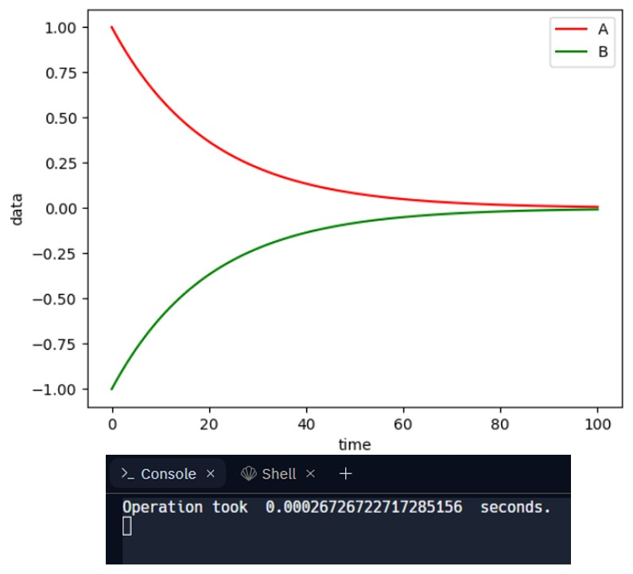

# Degradation of Data Integrity

## Overview

This project involves modeling the degradation of data integrity during the transfer of data between processors. Using a system of differential equations, we represent the interaction between processors and their data over time. The system is solved through matrix methods and the results are visualized to understand the degradation process.

## Part 1: Differential Equation Model for Data Transfer

We develop a model using a system of differential equations to describe data transfer. Each processor's output is influenced by the data it holds and the rate of data transfer between processors. This results in a system of equations whose eigenvalues are computed as:

$\lambda_1 = -0.0214, \quad \lambda_2 = -0.0531, \quad \lambda_3 = -0.1054$

These eigenvalues were derived from the third-degree polynomial obtained from the system's matrix.

## Part 2: Solving the System Using Matrix Methods

In the second part of the project, we solve for \( e^{At} \) (the matrix exponential) and use it to solve the system of differential equations. This allows us to analyze the long-term behavior of the data transfer and degradation in the system.

## Results

### Graph of Data Integrity Degradation

The following graph represents the degradation of data integrity for two processors over time:

> The x-axis represents time, while the y-axis shows the amount of data processed.

## Conclusion

Through matrix exponentiation and solving the system of differential equations, we demonstrated how the degradation of data integrity occurs over time. The eigenvalues of the system provide important insights into the rate of decay for the data transfer processes.

## How to Run the Project

* Download version 3.8.2+ of Python 
* Install pip
* Create a new project. Within the terminal, use pip to install the libraries below:

* `pip install numpy`, `pip install matplotlib`

* Download the code and locate the main.py file's directory
* In the terminal, change the directory to the location of main.py
* Run main.py
