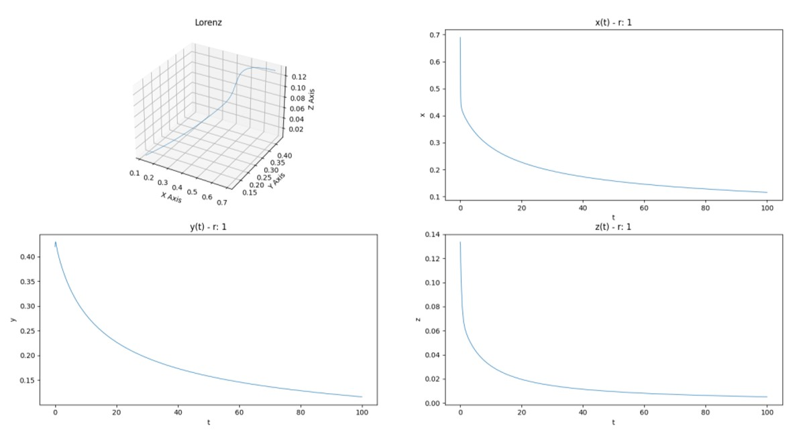
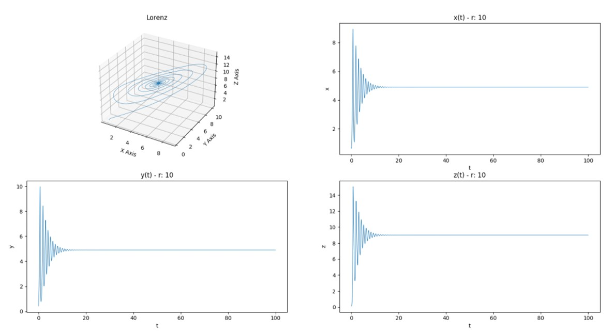
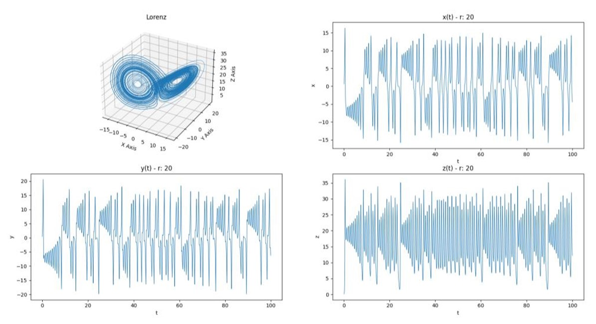

# Self-Organized Criticality  

## Introduction
As file systems grow and evolve over time, the fragmentation caused by the creation and deletion of files increases. Once the system reaches a critical point of fragmentation, it becomes significantly slower, making it harder to access files. This project uses the Lorenz equation to simulate and visualize what this critical point looks like as a dynamic system. The model shows how the system becomes more unstable as it approaches the critical point, which is analogous to a file system that becomes non-functional when it reaches a high level of fragmentation.

## Lorenz Equation Model
We model the fragmentation and degradation of system performance using the Lorenz equation, a set of three differential equations that describe a chaotic system. By altering the parameter \( R \), we simulate the system's behavior under different conditions, which helps us visualize how the critical point is reached.

The Lorenz equation is given by:

$\frac{dx}{dt} = s(y - x), \quad \frac{dy}{dt} = r x - y - xz, \quad \frac{dz}{dt} = xy - bz$

Where:
- $\( x, y, z \)$ are variables representing system states.
- $\( s, r, b \)$ are constants.
- $\( x(0) = 0.69 \, \ y(0) = 0.42 \, \ z(0) = 1.337 \)$ are the initial conditions.

The system's behavior is analyzed for three different values of $\( r \): \( r = 1 \), \( r = 10 \)$, and $\( r = 20 \)$. As \( r \) increases, the system becomes more chaotic, approaching the critical point.

## Graphical Results

### Lorenz Graphs for Varying \( r \)

The graphs below show the evolution of the Lorenz system for three values of \( r \). As \( r \) increases, the system exhibits increasingly complex behavior, ultimately approaching instability—similar to a file system at its critical fragmentation point.

- **For \( r = 1 \)**: A smooth, predictable curve.
- **For \( r = 10 \)**: The system becomes more chaotic and unstable.
- **For \( r = 20 \)**: The system reaches a state of high entropy, showing complex and erratic behavior.

#### Graph 1: Lorenz Attractor with \( r = 1 \)  

#### Graph 2: Lorenz Attractor with \( r = 10 \)  

#### Graph 3: Lorenz Attractor with \( r = 20 \)  

## Conclusion

This simulation demonstrates how chaotic behavior arises as system parameters change, with the Lorenz attractor providing a clear analogy to the degradation of file system performance as it approaches a critical point. By understanding this system, we gain insights into the potential for failure and performance degradation in complex systems like file storage.

## How to Run the Project

* Download version 3.8.2+ of Python 
* Install pip
* Create a new project. Within the terminal, use pip to install the libraries below:

* `pip install numpy`, `pip install matplotlib`

* Download the code and locate the main.py file's directory
* In the terminal, change the directory to the location of main.py
* Run main.py
