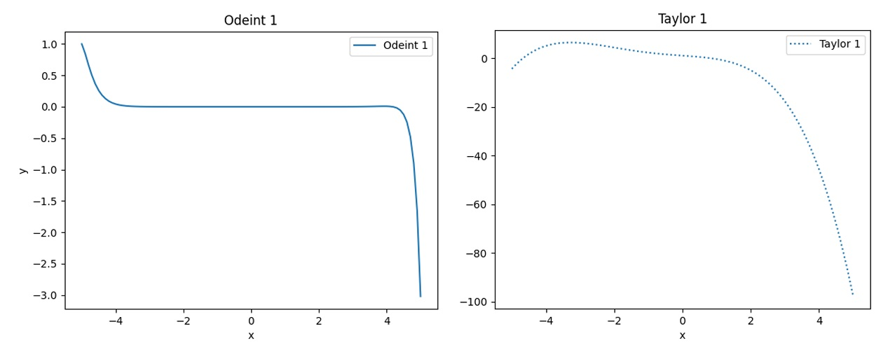
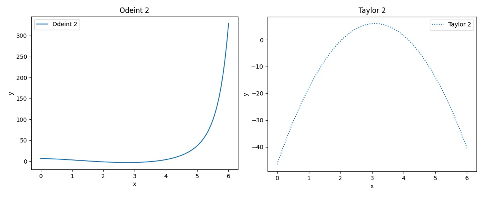
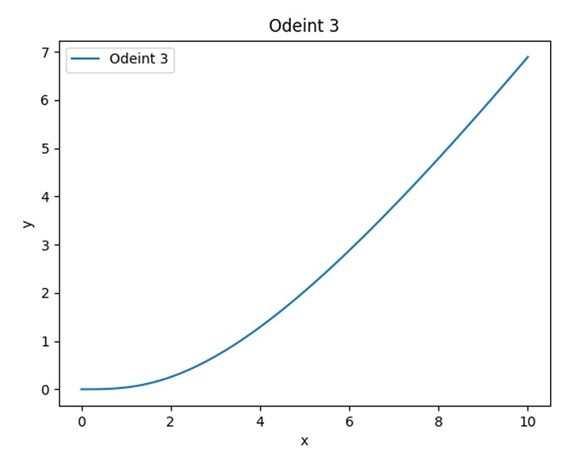

# Numeric Computations with Taylor Polynomials  

## Part 1

### a) Taylor Expansion for $\( y'' - 2xy' + x^2y = 0 \)$

In this part, we find the Taylor expansion of the differential equation $\( y'' - 2xy' + x^2y = 0 \)$ up to degree \( n \leq 4 \), with initial conditions $\( x = 0, y = 1, y' = -1 \)$. The goal is to compute \( y(3.5) \) using both the Taylor expansion and the solution obtained via `odeint`.

The Taylor method aims to provide an accurate representation around a given point of convergence (here \( x = 0 \)). At \( x = 6 \), a sharp divergence is observed between the Taylor solution and the `odeint` solution, demonstrating the limits of the Taylor method at larger \( x \)-values.

### b) Taylor Expansion for $\( y'' - (x - 2)y' + 2y = 0 \)$

For the equation \( y'' - (x - 2)y' + 2y = 0 \) with initial conditions $\( x = 3, y = 6, y' = 1 \)$, we compute the Taylor expansion up to \( n \leq 2 \). This expansion provides a less accurate result compared to the previous case due to the lower degree of the polynomial. The Taylor method diverges more rapidly here, with the solution being more than 300 units off from the `odeint` solution at \( x = 7 \).

## Part 2

We then solve the equation $\( (x^2 + 4)y'' + y = x \)$ using the recurrence formula. The resulting solution is graphed alongside the `odeint` results to illustrate the behavior of the system.

## Part 3

A differential equation modeling computer system performance is proposed:

$\frac{1}{x^2}y'' + \frac{1}{x}y' + y = x$

Where:
- \( x \) represents the cost of computer components,
- \( y'' \) represents CPU speed,
- \( y' \) represents memory speed,
- \( y \) represents memory size.

As the cost increases, the performance of the machine improves, but at a decreasing rate. A graph of the equation illustrates how performance improves gradually with increasing cost, with diminishing returns after a certain point.

## All Odeint and Taylor Graphs

### Graph 1: Odeint vs. Taylor for $\( y'' - 2xy' + x^2y = 0 \)$ 

### Graph 2: Odeint vs. Taylor for $\( y'' - (x - 2)y' + 2y = 0 \)$

### Graph 3: Computer System Performance Graph  

## Conclusion

This project demonstrates the power and limitations of the Taylor method for solving differential equations. While it provides accurate results near the point of convergence, its accuracy diminishes as we move farther from this point. Additionally, the proposed model for computer system performance highlights the trade-offs in upgrading components and how the system's performance improves with increasing cost, albeit at a diminishing rate.

## How to Run the Project

* Download version 3.8.2+ of Python 
* Install pip
* Create a new project. Within the terminal, use pip to install the libraries below:

* `pip install numpy`, `pip install matplotlib`

* Download the code and locate the main.py file's directory
* In the terminal, change the directory to the location of main.py
* Run main.py
