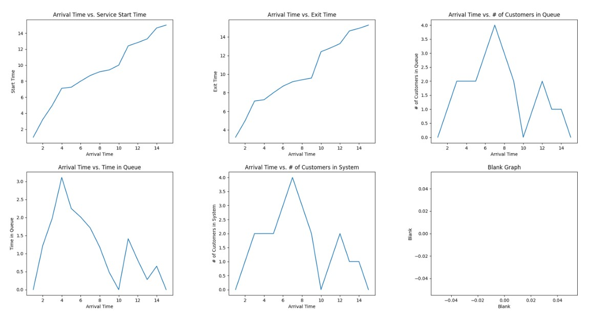

# Code Errors and the Butterfly Effect  

---

## Part 1: The Lorenz System

### Overview
In this section, we created a Python program to simulate the Lorenz system using a 3D graph. Users can input a value for \( r \), the Lorenz parameter, and the system's behavior is visualized dynamically. The program animates the evolution of the system in real-time, allowing users to experiment with different values of \( r \) and observe the butterfly effect in action.

### Steps:
1. **User Input**: The program accepts a value for \( r \) and displays a 3D animated graph of the Lorenz system.
2. **Animation**: The graph updates continuously, showing the chaotic nature of the system as points evolve.
3. **Code Structure**: The Lorenz system equations are defined in the function `lorenz()`, which calculates the system's differential equations. The `animate()` function updates the system's state over time, and the animation is managed by `FuncAnimation`.

---

## Part 2: Queue Analysis

### Customer Queue Simulation
We simulated customer service systems using a set of predefined service durations and arrival times. We calculated and plotted the service start times, exit times, time in queue, and the number of customers both in the system and in the queue.

The simulation results were plotted using `matplotlib`, and the trends observed in the graphs showed that the service times and queue lengths follow expected patterns, with peaks occurring when arrival times fall between 4 and 7 minutes.

### System Behavior Analysis
The system's behavior was explored through the following equations:
- **New Lambda**: Represents the rate of customer arrivals.
- **New Mu**: Represents the service rate.
- **New Rho**: Represents the utilization of the system.
- **New x**: Represents the number of customers in the system.
- **New E[N] and E[T]**: These values represent the expected number of customers in the system and the expected service time.

We plotted these equations against \( k \), a range of values from 1 to 1000, to visualize how these system characteristics change under different conditions.

---

## Graphs and Results

### 1. Lorenz System (Animated 3D Plot)

### 2. Customer Queue Analysis

  

---

## Conclusion

This project explored the dynamics of chaotic systems like the Lorenz system and applied similar principles to model and visualize customer service systems. The Lorenz system's butterfly effect demonstrated the sensitive dependence on initial conditions, while the queue analysis provided insights into service times, queue lengths, and system performance under varying conditions. The use of Python and `matplotlib` facilitated the visualization of these complex systems, showcasing the power of computational modeling in understanding real-world phenomena.

## How to Run the Project

* Download version 3.8.2+ of Python 
* Install pip
* Create a new project. Within the terminal, use pip to install the libraries below:

* `pip install numpy`, `pip install matplotlib`

* Download the code and locate the main.py file's directory
* In the terminal, change the directory to the location of main.py
* Run main.py

