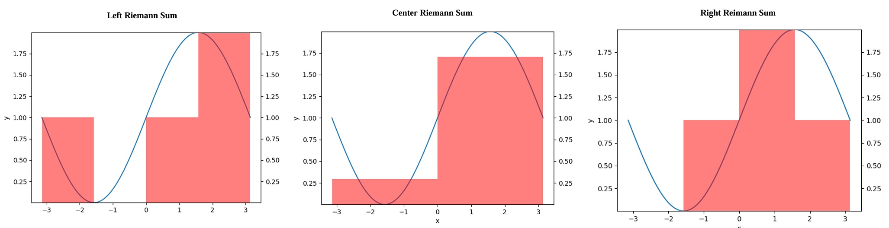

# Numerical Integration  

## Part 1: Riemann Sums of $\( f(x) = \sin(x) + 1 \)$

### Problem Statement  
We calculated the Riemann sums (Left, Center, and Right) for the function $\( f(x) = \sin(x) + 1 \)$ over the interval $\([- \pi, \pi]\)$ to approximate the integral.

### Methodology  
- **Function**: $\( f(x) = \sin(x) + 1 \)$.  
- **Interval**: $\([- \pi, \pi]\)$, divided into four subintervals of equal width.  
- **Riemann Sums**: Left, Center, and Right sums were computed using rectangles as approximation tools.  

### Results  
- **Left Riemann Sum**: Approximates the integral using left endpoints of subintervals.  
- **Center Riemann Sum**: Uses midpoints of subintervals for greater accuracy.  
- **Right Riemann Sum**: Uses right endpoints of subintervals for approximation.  

### Visualizations  
  

---

## Part 2: Download Rate Analysis  

### Dataset Description  
The dataset represents download rates $(\( \text{MB/s} \))$ collected every minute over a 30-minute period while downloading files using GCU's Ethernet connection.

### Analysis  
1. **Total Data Downloaded**:  
   - The graph of rate vs. time was analyzed, with the area under the graph representing the total data downloaded (~34 GB).  

2. **Average Download Speed**:  
   - Using total data and duration, an average rate of **18.77 MB/s** was calculated.  

### Results  
- The total data downloaded during the 30 minutes was approximately **34 GB**.  
- The average download speed was approximately **18.77 MB/s**.  

### Visualizations  
Download Rate vs. Time        |  Cumulative Data Downloaded
:-------------------------:             |:-------------------------:
  |  

---

## Conclusion  

1. **Part 1**: Numerical integration was applied using Riemann sums to approximate the integral of $\( f(x) = \sin(x) + 1 \)$.  
2. **Part 2**: The download rate analysis demonstrated practical use of Riemann sums to calculate total data downloaded, highlighting the versatility of numerical integration methods.  

This project successfully combined theoretical and applied aspects of numerical integration.

## How to Run the Project

* Download version 3.8.2+ of Python 
* Install pip
* Create a new project. Within the terminal, use pip to install the libraries below:

* `pip install numpy`, `pip install matplotlib`

* Download the code and locate the main.py file's directory
* In the terminal, change the directory to the location of main.py
* Run Riemann1.py
* Run Riemann2.py
* Run datastream.py
